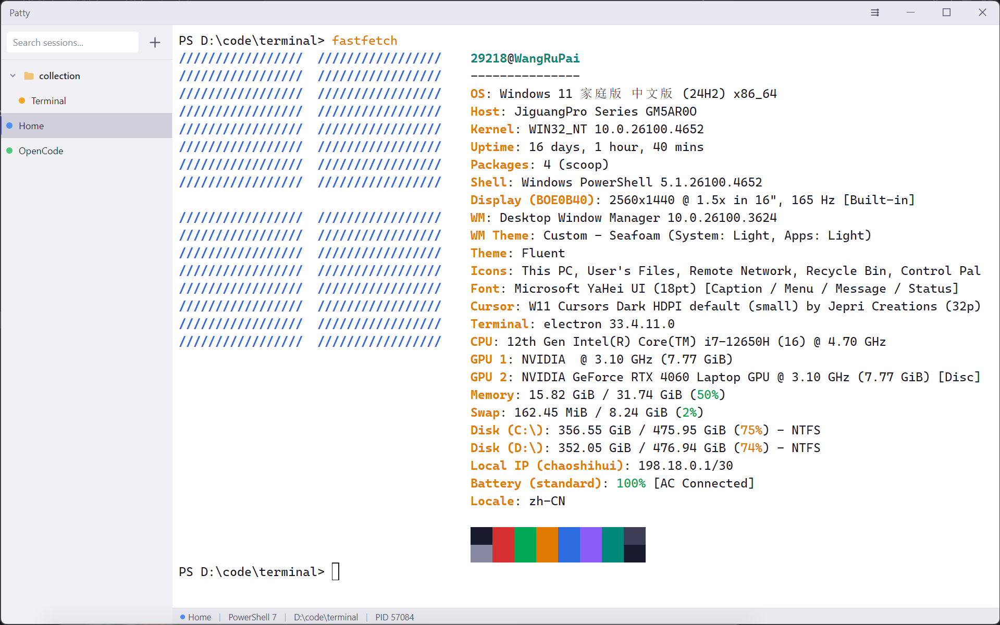

<div align="center">

# Patty

A modern, minimal terminal manager for Windows.


</div>

## Features

- **Multi-tab Terminal** - Create and manage multiple terminal sessions
- **Collection System** - Organize terminals into folders with nesting support
- **Customizable Interface** - Dark/Light themes, font settings, cursor styles
- **Search** - Quickly find terminals by name
- **Persistent State** - Sessions and collections survive restarts
- **Copy/Paste** - Ctrl+Shift+C/V in terminal
- **Drag & Drop** - Move terminals between collections
- **Custom Shortcuts** - Configurable keyboard shortcuts
- **AI Attention Notifications** - Visual indicators when Claude Code or OpenCode needs your input

## Screenshot

<div align="center">



</div>

## Supported Shells

| Shell | Command |
|-------|---------|
| PowerShell 7 | `pwsh` |
| Windows PowerShell | `powershell` |
| CMD | `cmd` |
| Git Bash | `gitbash` |
| WSL | `wsl` |

## AI Attention Notifications

Patty can show visual indicators when AI coding assistants need your attention:

| Event | Color | Description |
|-------|-------|-------------|
| Permission Request | 🔵 Blue | Tool needs permission to run |
| Question | 🔵 Blue | AI is asking for clarification |
| Task Complete | 🟢 Green | AI finished responding |
| Error | 🔴 Red | Execution error occurred |

### Supported AI Tools

- **Claude Code** - Via Notification and Stop hooks
- **OpenCode** - Via plugin system

### Configuration

Go to **Settings → Notifications** to enable/disable for each AI tool independently.

> When disabled, external config files (Claude Code settings.json, OpenCode plugin) will not be modified.

## Installation

### From Source

```bash
# Clone the repository
git clone https://github.com/paipaipai666/patty.git
cd patty

# Install dependencies
npm install

# Run in development mode
npm run dev
```

### Build Installer

```bash
# Package as NSIS installer
npm run package
```

The installer will be created in the `dist` directory.

## Keyboard Shortcuts

| Shortcut | Action |
|----------|--------|
| `Ctrl+T` | New terminal |
| `Ctrl+W` | Close current terminal |
| `Ctrl+]` / `Ctrl+[` | Next / Previous terminal |
| `Ctrl+B` | Toggle sidebar |
| `Ctrl+1-9` | Jump to terminal by index |
| `Ctrl+Shift+C` | Copy in terminal |
| `Ctrl+Shift+V` | Paste in terminal |

## Tech Stack

- **Framework**: Electron + electron-vite
- **Language**: TypeScript
- **UI**: React 18 + CSS Modules
- **Terminal**: xterm.js + WebGL renderer
- **Backend**: node-pty (Windows ConPTY)
- **State**: Zustand

## Project Structure

```
patty/
├── src/
│   ├── main/          # Electron main process
│   │   ├── index.ts           # App entry point
│   │   ├── ptyManager.ts      # PTY management + Hook Server
│   │   ├── hookInstaller.ts   # Claude Code/OpenCode hook installer
│   │   ├── ipcHandlers.ts     # IPC handlers
│   │   └── settingsHandler.ts # Settings persistence
│   ├── preload/       # Preload scripts
│   ├── renderer/      # React application
│   │   ├── components/
│   │   ├── store/
│   │   └── styles/
│   └── shared/        # Shared types
├── resources/
│   ├── icon.ico               # App icon
│   ├── patty-hook.ps1         # Claude Code notification hook
│   └── opencode-patty-plugin.ts  # OpenCode notification plugin
└── package.json
```

## License

This project is licensed under the MIT License - see the [LICENSE](LICENSE) file for details.

## Acknowledgments

- [xterm.js](https://xtermjs.org/) - Terminal emulator for the web
- [Electron](https://www.electronjs.org/) - Build cross-platform desktop apps
- [Zustand](https://github.com/pmndrs/zustand) - State management
