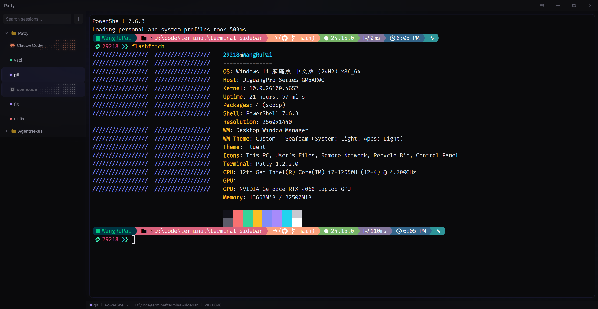
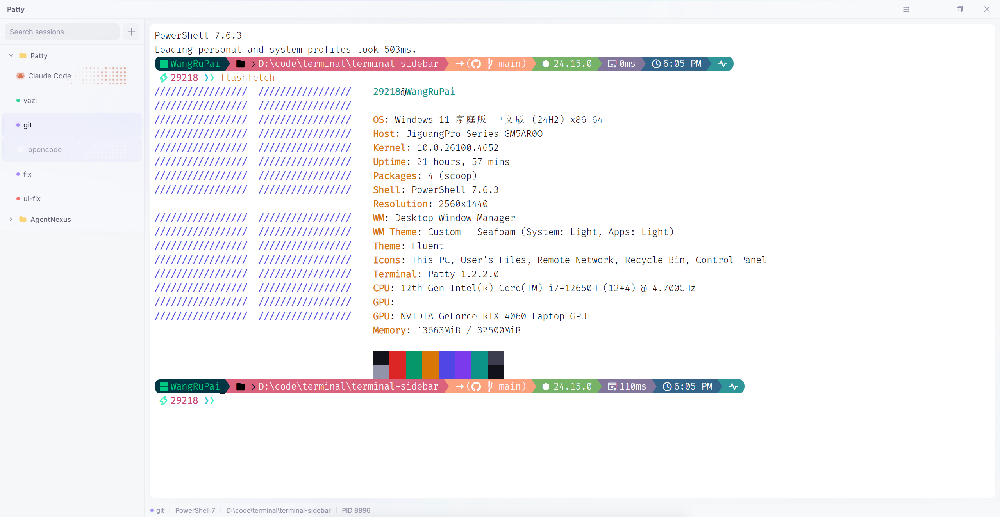

<div align="center">


# Patty

A modern, minimal terminal manager for Windows with a sidebar layout.


</div>

## Features

- **Multi-tab Terminal** - Create and manage multiple terminal sessions with independent PTY processes
- **Collection System** - Organize terminals into nested folders with full drag-and-drop support
- **5 Shell Support** - PowerShell 7, Windows PowerShell, CMD, Git Bash, and WSL
- **Fully Customizable UI** - Dark/Light themes plus fully custom themes with visual color picker and JSON editor; import/export themes
- **Customizable Terminal** - Font family (with system font picker), font size (8-32), cursor style (block/underline/bar), cursor blink, terminal opacity (40-100%)
- **Resizable Sidebar** - Left or right positioning with session search/filter
- **Context Menus** - Rename, recolor, close sessions; create, rename, delete subcollections
- **Status Bar** - Shows active session name, shell type, current working directory, and PID
- **Configurable Shortcuts** - All keyboard shortcuts remappable in settings
- **Session Persistence** - Sessions and collections survive restarts with auto-save
- **AI Attention Notifications** - Visual indicators when Claude Code, OpenCode, or Codex CLI needs your input

## Screenshot

### Dark

<div align="center">



</div>

### Light

<div align="center">



</div>

## Supported Shells

| Shell | ID |
|-------|-----|
| PowerShell 7 | `pwsh` |
| Windows PowerShell | `powershell` |
| Command Prompt | `cmd` |
| Git Bash | `gitbash` |
| WSL | `wsl` |

## AI Attention Notifications

Patty integrates with AI coding assistants to show colored visual indicators on sidebar items when they need your attention:

| Event | Color | Description |
|-------|-------|-------------|
| Permission Request | 🔵 Blue | Tool needs permission to run |
| Question | 🔵 Blue | AI is asking for clarification |
| Task Complete | 🟢 Green | AI finished responding |
| Error | 🔴 Red | Execution error occurred |

Notification events trigger an animated contribution-grid style effect and a colored glow on the session item.

### Supported AI Tools

- **Claude Code** - Via Notification and Stop hooks (PowerShell hook script)
- **OpenCode** - Via plugin system (TypeScript plugin)
- **Codex CLI** - Via lifecycle hooks (PowerShell hook script)

### Configuration

Go to **Settings → Notifications** to enable or disable for each AI tool independently.

> When disabled, external config files (Claude Code `settings.json`, OpenCode plugin directory, Codex CLI `hooks.json`) will not be modified.

## Settings

The settings modal covers 5 categories:

| Category | Options |
|----------|---------|
| **Appearance** | Dark/Light/Custom themes, font family (system font picker), font size |
| **Terminal** | Cursor style (block/underline/bar), cursor blink, terminal opacity (40-100%), default shell |
| **Shortcuts** | Remap all keyboard shortcuts via key capture |
| **Layout** | Sidebar position (left/right) |
| **Notifications** | Toggle AI notifications for Claude Code, OpenCode, and Codex CLI independently |

Custom themes can be edited visually with color pickers or directly as JSON, with import/export support.

## Keyboard Shortcuts

| Shortcut | Action |
|----------|--------|
| `Ctrl+T` | New terminal |
| `Ctrl+W` | Close current terminal |
| `Ctrl+]` / `Ctrl+[` | Next / Previous terminal |
| `Ctrl+B` | Toggle sidebar |
| `Ctrl+1-9` | Jump to terminal by index |
| `Ctrl+C` | Copy selection in terminal, or send interrupt if no selection |
| `Ctrl+V` | Paste in terminal |
| `Ctrl+Shift+C` | Copy in terminal |
| `Ctrl+Shift+V` | Paste in terminal |

All shortcuts are remappable in Settings.

## Installation

### From Source

Prerequisites: Node.js 20+ and a stable Rust toolchain (1.77+).

```bash
# Clone the repository
git clone https://github.com/paipaipai666/patty.git
cd patty

# Install dependencies
npm install

# Run in development mode
npm run dev
```

### Build Installer

```bash
# Package as NSIS installer
npm run package
```

The installer will be created in `src-tauri/target/release/bundle/nsis`.

## Tech Stack

- **Framework**: Tauri 2 (Rust backend + system WebView2)
- **Language**: TypeScript 5.7 (strict mode) + Rust (edition 2021)
- **UI**: React 18.3 + CSS Modules
- **Terminal**: xterm.js 5.5 (WebGL renderer with canvas fallback, Fit, WebLinks, Unicode11 addons)
- **PTY**: portable-pty (Windows ConPTY)
- **State**: Zustand 5
- **Packaging**: tauri-bundler (NSIS installer)

## Project Structure

```
patty/
├── src-tauri/
│   ├── src/
│   │   ├── main.rs              # App entry, command registration, startup wiring
│   │   ├── pty.rs               # PTY sessions (spawn/write/resize/kill, preheat, ConPTY DSR)
│   │   ├── hooks.rs             # Hook HTTP server, heartbeat watchdog, attention mapping
│   │   ├── installer.rs         # Claude Code / OpenCode / Codex hook installers
│   │   ├── store.rs             # Settings/state JSON persistence with migration
│   │   ├── metrics.rs           # Resource metrics collector (PowerShell counters)
│   │   └── fonts.rs             # System font enumeration (registry)
│   ├── tauri.conf.json          # Window, bundle (NSIS), resource mapping
│   └── capabilities/            # IPC permission set
├── src/
│   ├── renderer/                # React application
│   │   ├── api.ts               # window.terminalAPI shim over Tauri invoke/listen
│   │   ├── components/
│   │   │   ├── TitleBar/        # Custom frameless title bar
│   │   │   ├── Sidebar/         # Sidebar, session tree, collection tree
│   │   │   ├── Terminal/        # xterm.js terminal panes
│   │   │   ├── Pane/            # Split tree, sash, drag-drop targets
│   │   │   ├── StatusBar/       # Session info bar
│   │   │   ├── Settings/        # Settings modal (5 categories)
│   │   │   ├── ContributionGrid/ # Animated AI activity indicator
│   │   │   └── common/          # ContextMenu, PromptDialog, Toasts
│   │   ├── store/               # Zustand stores (session, workspace, settings, toast)
│   │   ├── hooks/               # Shared React hooks
│   │   └── styles/              # Global CSS, theme definitions
│   └── shared/                  # Shared TypeScript types
├── resources/                   # App icon, Claude Code hook, OpenCode plugin
├── scripts/shell-integration/   # Shell startup scripts injected into PTYs
├── logo/                        # Logo assets
├── vite.config.ts
├── package.json
├── tsconfig.json
└── ...
```

## License

This project is licensed under the MIT License - see the [LICENSE](LICENSE) file for details.

## Acknowledgments

- [xterm.js](https://xtermjs.org/) - Terminal emulator for the web
- [Tauri](https://v2.tauri.app/) - Build tiny, fast desktop apps with a web frontend
- [Zustand](https://github.com/pmndrs/zustand) - State management
