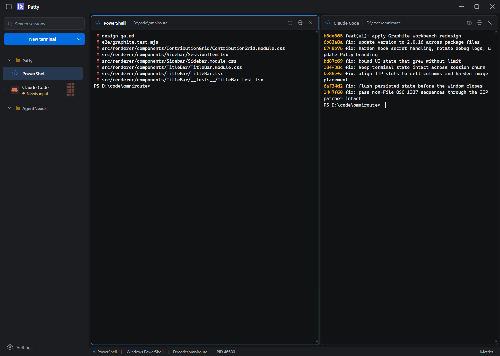
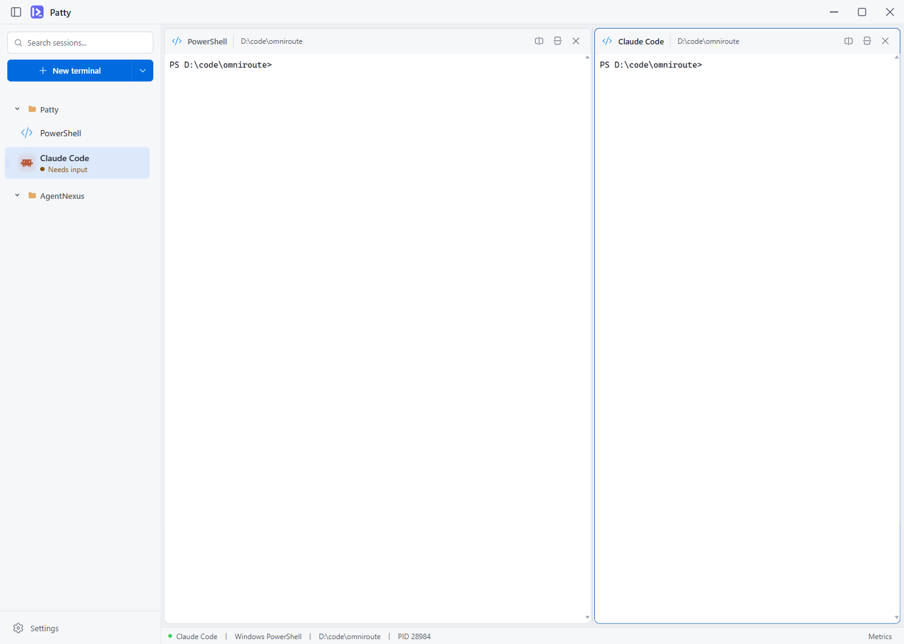

<div align="center">


# Patty

A Windows terminal manager for local shells, SSH connections, and AI coding tools.


</div>

Patty keeps sessions in a searchable sidebar and displays them in split workspaces. It uses Tauri 2, React, and xterm.js, with a Rust backend for local terminals, SSH, and resource monitoring.

## Features

- **Sessions and collections.** Rename and color sessions, organize them in nested collections, and move them with drag and drop. Navigate the sidebar with the keyboard.
- **Split workspaces.** Split to the right or below, resize panes, and drag sessions into a layout. Selecting a sidebar session returns to its workspace and focuses its pane. Local splits inherit the shell and working directory.
- **Local shells.** Use PowerShell 7, Windows PowerShell, CMD, Git Bash, or WSL. Local terminals use a bundled Microsoft ConPTY runtime for resizing and text reflow.
- **SSH.** Save connection profiles, import `~/.ssh/config`, and connect with passwords or private keys. An SSH command bar provides command history and suggestions. The remote monitor displays CPU, memory, network, and disk usage on Linux hosts.
- **Terminal display.** Choose system fonts, cursor shape, blinking, opacity, and scrollback size. Terminal output supports Unicode and inline image previews.
- **Themes.** Choose Dark, Light, Dracula, Nord, Tokyo Night, or Solarized Light. Create custom themes with color pickers or JSON, and import or export them.
- **AI attention indicators.** See when supported coding tools need input, finish a turn, or report an error, with tool icons, animated activity grids, and status labels in the sidebar.
- **Local metrics.** Open the Metrics dashboard for CPU, memory, GPU, and process information. Local metrics are sampled while the dashboard is open.

## Screenshots

### Dark theme



### Light theme



These previews were captured during the Graphite workbench validation on 2026-10-28, using demonstration sessions and a simulated AI attention event. The title-bar logo visible in these captures has since been removed.

## Install

Download a Windows installer from [Releases](https://github.com/paipaipai666/patty/releases). The NSIS installer installs Patty for the current user.

Patty requires Windows and Microsoft Edge WebView2. PowerShell 7, Git Bash, WSL, and AI tools must be installed separately to use them. The ConPTY runtime is included with Patty.

## Use sessions and workspaces

1. Click **New terminal** in the sidebar to open the default shell. Use its dropdown to choose a folder, create a collection, or open an SSH profile. Change the default shell under **Settings → Terminal**.
2. Use the pane header buttons to split to the right or below. Drag the divider to resize the panes.
3. Select a session in the sidebar to focus it and return to its saved workspace layout. Drag sidebar sessions into panes to rearrange the layout.
4. Double-click a session name or press `F2` while its sidebar row is focused to rename it. Right-click a session or collection for more actions.

Search sessions by name, working directory, shell, AI tool, SSH host or user, or collection name. Combine words to narrow the results across fields, such as `payments codex`. Search also finds sessions inside collapsed collections and accepts either slash style in Windows paths.

Use **Session view** below the search field to show all sessions, sessions that need attention, or completed turns. Needs attention includes tools waiting for input and tools reporting an error. The counts cover all current sessions; search narrows the selected view. Filtering reveals matching sessions inside collapsed collections and keeps the active terminal running.

The status bar shows the selected session, shell, directory or SSH target, and local process ID when available. **Metrics** opens the local dashboard; **Monitor** is available for SSH sessions.

Patty saves session definitions, collections, workspace layouts, and settings automatically. Restarting Patty opens new shell processes; it does not resume running commands or restore terminal scrollback.

### Supported shells

| Shell | ID |
| --- | --- |
| PowerShell 7 | `pwsh` |
| Windows PowerShell | `powershell` |
| Command Prompt | `cmd` |
| Git Bash | `gitbash` |
| WSL | `wsl` |
| SSH connection | `ssh` |

Manage SSH profiles under **Settings → SSH**. Patty uses an in-process SSH client and prompts for credentials, private-key passphrases, and unknown host keys. Host-key checks use your `~/.ssh/known_hosts` and Patty's own known-hosts file.

## AI attention indicators

Run supported AI tools inside a local Patty terminal so their hooks can identify the session.

| Tool | Adapter |
| --- | --- |
| Claude Code | Lifecycle hooks |
| OpenCode | TypeScript plugin |
| Codex CLI | Lifecycle hooks |
| Oh My Pi | TypeScript extension |
| Qwen Code | Lifecycle hooks |
| GitHub Copilot CLI | Hook configuration |

| Sidebar status | Meaning |
| --- | --- |
| Status unavailable | The tool process is alive, but its periodic heartbeat stopped |
| Idle | The tool started; no work has been reported |
| Working | The tool reported prompt processing or tool execution |
| Waiting for approval | A permission request needs a decision |
| Waiting for answer | The tool asked a question or requested input |
| Completed | The tool finished responding |
| Error | The tool reported an error |

Session rows show the tool and working folder or SSH target below the task name. Status badges use compact labels such as Approval, Answer, and Done; their tooltips and accessible names provide the full status. Narrow sidebars keep the status icon. A separate dot marks unread activity. The activity grid appears only while a background agent is working.

Narrow sidebars prioritize the folder or SSH target below each task. Pane headers show a short local folder or the remote connection target; full paths remain in tooltips. Split and close controls stay visible for the focused pane and appear on hover or keyboard focus in other panes.

Hover or keyboard-focus a session for 400ms to preview its complete title, tool, folder, SSH target and latest agent status. The preview does not select the session or mark its notice read. You can move the pointer into the card to read or select its text. Press Escape to dismiss it.

Selecting a session or typing in its terminal marks its latest notice as read and stops the attention glow. Its runtime status remains visible. The **Needs you** view continues to include waiting and failed sessions after they are read. The **Completed** view includes completed responses until the tool reports new work or exits. A new prompt or tool execution replaces the previous completion or error with **Working**. Available state transitions depend on the events each CLI adapter reports.

Use the **Next session needing attention** arrow beside the sidebar view selector to cycle through waiting and failed sessions in session order. It searches all sessions, including collapsed collections and results hidden by the current search or view. It selects the target workspace and pane, preserves the current search and view, and marks the notice as read. When no session needs attention, the button is disabled. You can reach the button with Tab and activate it with Enter or Space.

Use **Settings → Notifications** to enable or disable each adapter. Enabling an adapter installs Patty's integration in that tool's configuration; disabling it removes Patty's integration. Restart an already-running AI tool after changing its hook configuration. Available events depend on the tool's hooks.

Patty checks that hook events belong to the current local terminal and CLI process. Events from an earlier run or conversation cannot replace the current state. Closing a layout pane keeps its session and status in the sidebar. Closing the session, exiting the tool, or disabling its adapter clears the status. Process exit detection can take up to one watchdog interval of five seconds.

OpenCode and Oh My Pi send periodic heartbeats. If a heartbeat expires while the process remains alive, **Status unavailable** replaces its last reported state until a fresh state event arrives. Claude Code, Codex, Qwen Code, and Copilot CLI use event callbacks; silence alone does not count as exit. Reloading the window reads the backend's current states. Runtime states are not restored after an application restart.

The sidebar heading contains **New terminal** (+) and a menu for other creation options. Search keeps its own row; the view selector and next-attention arrow share a row.

## Settings

| Category | Options |
| --- | --- |
| Appearance | Built-in and custom themes, theme import and export, system font picker, font size from 8 to 32 |
| Terminal | Default shell, cursor shape and blinking, opacity from 40% to 100%, scrollback of 1,000, 2,000, 5,000, or 10,000 lines |
| Shortcuts | Remap application shortcuts by recording a key combination |
| Layout | Place the sidebar on the left or right |
| Notifications | Enable or disable individual AI adapters |
| SSH | Create and edit connection profiles, select identity files, import SSH config |

Scrollback changes apply to newly created terminals. The sidebar width can be adjusted by dragging its divider.

## Keyboard shortcuts

These are the default application shortcuts. Remap them under **Settings → Shortcuts**.

| Shortcut | Action |
| --- | --- |
| `Ctrl+T` | New terminal |
| `Ctrl+W` | Close the current terminal |
| `Ctrl+]` | Next session |
| `Ctrl+[` | Previous session |
| `Ctrl+B` | Toggle the sidebar |
| `Ctrl+,` | Open settings |
| `Ctrl+Shift+D` | Split to the right |
| `Ctrl+Shift+E` | Split below |
| `Ctrl+Shift+W` | Close the focused pane |

`Ctrl+1` through `Ctrl+9` select sessions by index. With a sidebar row focused, `F2` renames it and `Delete` closes a session. These bindings are separate from the remappable shortcuts above. When terminal input has focus, terminal and shell key bindings take precedence.

In the terminal, `Ctrl+C` copies selected text or sends an interrupt when nothing is selected. `Ctrl+V` pastes; `Ctrl+Shift+C` and `Ctrl+Shift+V` also copy and paste.

## Build from source

Development requires Windows with:

- Git.
- Node.js compatible with the installed tools: 20.19+ within 20.x, 22.13+ within 22.x, or 24+. CI uses Node.js 20.x and npm 11.
- A current stable Rust toolchain with the MSVC target.
- Visual Studio Build Tools with **Desktop development with C++** and a Windows SDK.
- Microsoft Edge WebView2 Runtime.

Install dependencies and start the desktop app:

```powershell
git clone https://github.com/paipaipai666/patty.git
cd patty
npm ci
npm run dev
```

On Windows, `npm ci` downloads and verifies the pinned Microsoft ConPTY package through `postinstall`. Tauri's development and build hooks also prepare the native files. For offline preparation and integrity checks, see [Bundled ConPTY runtime](resources/conpty.md).

### Build an installer

```powershell
npm run package:nsis
```

`npm run package` also builds the configured NSIS bundle. The default output directory is `src-tauri/target/release/bundle/nsis/`; a custom Cargo target directory changes that location. Keep the bundled ConPTY files with the application when distributing a build.

`npm run build` only builds the frontend into `out/renderer/`. Use a package command to compile the Rust application and produce an installer.

## Run checks

After `npm ci`, run the same checks used by CI:

```powershell
npm test
npm run typecheck
npm run check:comments
cargo test --manifest-path src-tauri/Cargo.toml --all-targets
```

To verify the prepared native files:

```powershell
npm run check:conpty
```

If installation scripts were skipped, run `npm run prepare:conpty` before invoking Cargo directly.

### Test the desktop app

Build the dedicated test executable first with `npm run build:e2e`. Save your work and close other Patty instances before running UI tests, because the application runs as a single instance.

```powershell
npm run test:e2e:isolation
npm run test:e2e
npm run test:e2e:graphite
npm run test:e2e:sessions
New-Item -ItemType Directory -Force output/resize | Out-Null
node e2e/resize.test.mjs . output/resize
```

The UI harness isolates `APPDATA`, WebView2 data, and Patty's CLI integration configuration. It preserves the operating system's `USERPROFILE` and `HOME`. Only builds with the `e2e` Cargo feature accept `PATTY_E2E_INTEGRATION_HOME`; ordinary builds reject that environment variable before opening a window or installing hooks. Set `PATTY_EXE` to use an E2E executable at another path. Rebuild with `npm run package:nsis` before distributing the application.

`npm run test:e2e:isolation` checks all six CLI adapters and repeatable temporary-directory cleanup without CDP. The other tests control WebView2 through CDP and cover terminal lifecycle, layout and themes, and continuous output during maximize, divider dragging, and sibling-pane closure. The resize test also checks Unicode, alternate buffers, resize failure recovery, and bounded scrollback.

After building an ordinary release executable, `node e2e/isolation.test.mjs --expect-unsupported-build` verifies that it rejects the test override before starting WebView2 or installing hooks.

If the installed WebView2 runtime refuses the CDP connection, `node e2e/session-workflow.test.mjs --native` opens the same isolated session fixture for native-window verification. Close that test window to remove its temporary data. This mode does not report an automated pass.

`npm run test:e2e:graphite` writes UI screenshots under `output/graphite/`. `npm run benchmark:startup` measures startup using the same harness.

## Project structure

| Path | Purpose |
| --- | --- |
| `src/renderer/` | React UI, Zustand stores, themes, and terminal rendering |
| `src/renderer/components/Pane/` | Stable terminal hosts, split layout, dividers, and drop targets |
| `src/renderer/components/Terminal/` | xterm.js panes, resize queue, and inline image handling |
| `src/shared/` | Shared types, persistence models, and normalizers |
| `src-tauri/src/lib.rs` | Window startup and Tauri commands |
| `src-tauri/src/pty.rs` | Local PTY lifecycle, preheated sessions, input queue, and output delivery |
| `src-tauri/src/conpty.rs` | Bundled ConPTY runtime loading |
| `src-tauri/src/sshconn.rs` | SSH connections, authentication, host-key prompts, and remote metrics |
| `src-tauri/src/hooks.rs` and `installer.rs` | AI hook event server and adapter installation |
| `src-tauri/src/store.rs` | Settings and workspace persistence |
| `resources/` | Hook adapters, app icon, hook protocol, and ConPTY manifest |
| `scripts/` | ConPTY preparation, shell integration, version sync, and development checks |
| `e2e/` | Desktop UI tests and CDP harness |
| `.github/workflows/` | Windows build, test, and release workflows |

The backend uses Windows APIs for terminals, fonts, and local metrics. See [CONTRIBUTING.md](CONTRIBUTING.md) for contribution guidelines.

## License

Patty is licensed under the [MIT License](LICENSE). The bundled Microsoft ConPTY runtime includes its [MIT notice](licenses/conpty-LICENSE.txt).

## Acknowledgments

- [Tauri](https://v2.tauri.app/)
- [xterm.js](https://xtermjs.org/)
- [Zustand](https://github.com/pmndrs/zustand)
- [Microsoft Terminal and ConPTY](https://github.com/microsoft/terminal)

The browser-only workbench check is available with `npm run test:visual:workbench`. It captures real frontend components with a fixed terminal replay transport. See [Frontend polish](docs/frontend-polish.md) for scope and verification.
